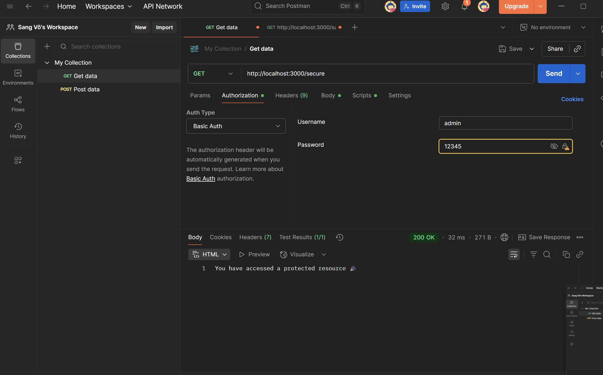
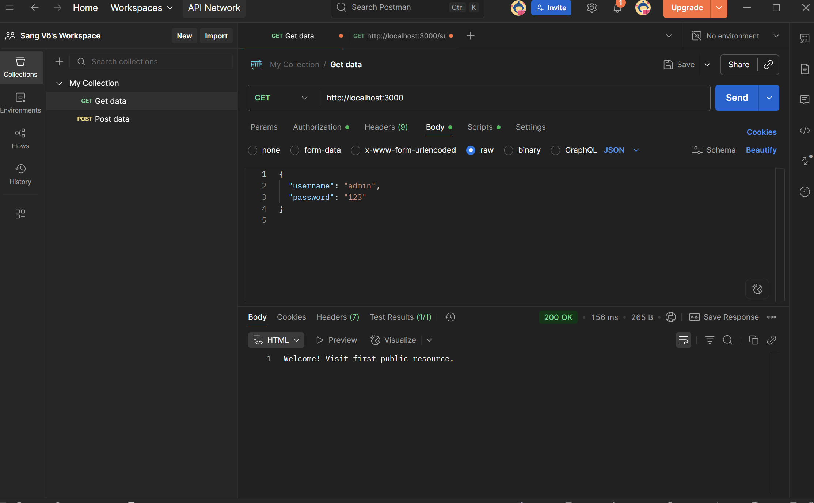
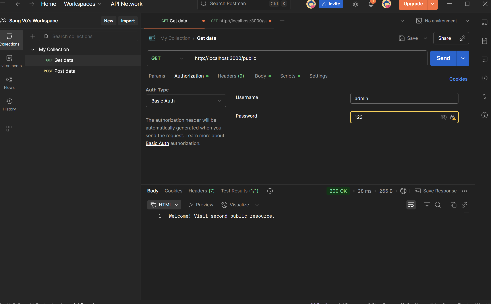

simple_auth
# Simple Authentication

Dự án này minh họa cách sử dụng **Basic Auth** và **Cookie Auth** trong Node.js để xác thực người dùng.

---

## Cách chạy
```bash
cd simple_auth
npm install
node basic_auth.js     # chạy Basic Auth
node cookie_auth.js    # chạy Cookie Auth


Server chạy tại http://localhost:3000

Test bằng Postman
1. Basic Auth

Method: GET

URL: http://localhost:3000

Tab Auth → chọn Basic Auth

Username: admin

Password: 12345

2. Cookie Auth

Method: GET

URL: http://localhost:3000

Khi gửi request, server trả về Set-Cookie trong response headers

Cookie được lưu để quản lý session

cd simple_auth
npm install
node basic_auth.js     # chạy Basic Auth
node cookie_auth.js    # chạy Cookie Auth


Server chạy tại http://localhost:3000

Test bằng Postman
1. Basic Auth

Method: GET

URL: http://localhost:3000

Tab Auth → chọn Basic Auth

Username: admin

Password: 12345

2. Cookie Auth

Method: GET

URL: http://localhost:3000

Khi gửi request, server trả về Set-Cookie trong response headers

Cookie được lưu để quản lý session



